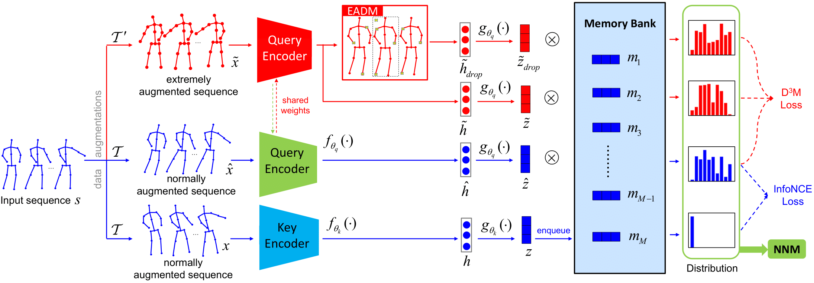
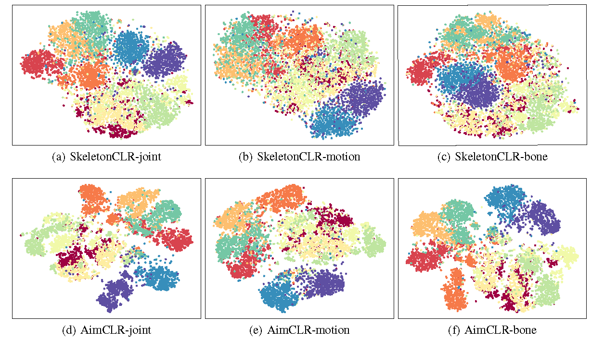

# AimCLR

This is an official PyTorch implementation of **"Contrastive Learning from Extremely Augmented Skeleton Sequences for Self-supervised Action Recognition" in AAAI2022**. 



## Requirements
      

## Data Preparation
- Download the raw data of [NTU RGB+D](https://github.com/shahroudy/NTURGB-D) and [PKU-MMD](https://www.icst.pku.edu.cn/struct/Projects/PKUMMD.html).
- For NTU RGB+D dataset, preprocess data with `tools/ntu_gendata.py`. For PKU-MMD dataset, preprocess data with `tools/pku_part1_gendata.py`.
- Then downsample the data to 50 frames with `feeder/preprocess_ntu.py` and `feeder/preprocess_pku.py`.
- If you don't want to process the original data, download the file folder in Google Drive [action_dataset](https://drive.google.com/drive/folders/1VnD3CLcD7bT5fMGI3tDGPlcWZmBbXS0m?usp=sharing) or BaiduYun link [action_dataset](https://pan.baidu.com/s/1NRK1ksRHgng_NkOO1ZYTcQ), code: 0211. NTU-120 is also provided: [NTU-120-frame50](https://drive.google.com/drive/folders/1dn8VMcT9BYi0KHBkVVPFpiGlaTn2GnaX?usp=sharing).

## Installation
  ```bash
# Install torchlight
$ cd torchlight
$ python setup.py install
$ cd ..
  
# Install other python libraries
$ pip install -r requirements.txt
  ```

## Unsupervised Pre-Training

Example for unsupervised pre-training of **3s-AimCLR**. You can change some settings of `.yaml` files in `config/ntu60/pretext` folder.
```bash
# train on NTU RGB+D xview joint stream
$ python main.py pretrain_aimclr --config config/ntu60/pretext/pretext_aimclr_xview_joint.yaml

# train on NTU RGB+D xview motion stream
$ python main.py pretrain_aimclr --config config/ntu60/pretext/pretext_aimclr_xview_motion.yaml

# train on NTU RGB+D xview bone stream
$ python main.py pretrain_aimclr --config config/ntu60/pretext/pretext_aimclr_xview_bone.yaml
```

## Linear Evaluation

Example for linear evaluation of **3s-AimCLR**. You can change `.yaml` files in `config/ntu60/linear_eval` folder.
```bash
# Linear_eval on NTU RGB+D xview
$ python main.py linear_evaluation --config config/ntu60/linear_eval/linear_eval_aimclr_xview_joint.yaml

$ python main.py linear_evaluation --config config/ntu60/linear_eval/linear_eval_aimclr_xview_motion.yaml

$ python main.py linear_evaluation --config config/ntu60/linear_eval/linear_eval_aimclr_xview_bone.yaml
```

## Trained models

We release several trained models in [released_model](https://drive.google.com/drive/folders/1VnD3CLcD7bT5fMGI3tDGPlcWZmBbXS0m?usp=sharing). The performance is better than that reported in the paper. You can download them and test them with linear evaluation by changing `weights` in `.yaml` files.

For three-streams results, you can train three separate models and ensemble the results, or you can use three models in one `.py` file, similar to `net/crossclr_3views.py`.

|     Model     | NTU 60 xsub (%) | NTU 60 xview (%) | PKU-MMD Part I (%) |
| :-----------: | :-------------: | :--------------: | :----------------: |
| AimCLR-joint  |      74.34      |      79.68       |       83.43        |
| AimCLR-motion |      68.68      |      71.83       |       72.00        |
|  AimCLR-bone  |      71.87      |      77.02       |       82.03        |
|   3s-AimCLR   |    **79.18**    |    **84.02**     |     **87.79**      |

## Visualization

The [**t-SNE**](https://www.jmlr.org/papers/volume9/vandermaaten08a/vandermaaten08a.pdf) visualization of the embeddings after AimCLR pre-training on NTU60-xsub.




## Citation
Please cite our paper if you find this repository useful in your resesarch:

```
@inproceedings{guo2022aimclr,
  Title= {Contrastive Learning from Extremely Augmented Skeleton Sequences for Self-supervised Action Recognition},
  Author= {Tianyu, Guo and Hong, Liu and Zhan, Chen and Mengyuan, Liu and Tao, Wang  and Runwei, Ding},
  Booktitle= {AAAI},
  Year= {2022}
}
```

## Acknowledgement
The framework of our code is extended from the following repositories. We sincerely thank the authors for releasing the codes.
- The framework of our code is based on [CrosSCLR](https://github.com/LinguoLi/CrosSCLR).
- The encoder is based on [ST-GCN](https://github.com/yysijie/st-gcn/blob/master/OLD_README.md).

## Licence

This project is licensed under the terms of the MIT license.
